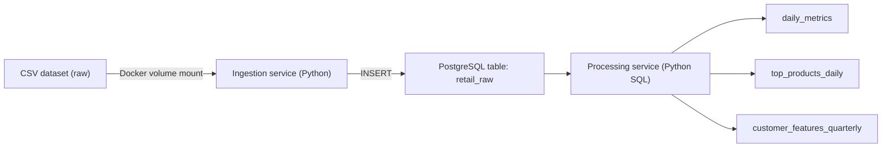

# Data Engineering Portfolio (DLMDSEDE02) — Batch Processing Pipeline

A reproducible **batch-processing** data architecture using **Docker Compose + PostgreSQL + Python microservices**:
- **postgres** service: data storage (warehouse)
- **ingestion** service: loads raw CSV files into `retail_raw` (chunked)
- **processing** service: creates analytics tables:
  - `daily_metrics`
  - `top_products_daily`
  - `customer_features_quarterly`

---

## 1) Architecture (high-level)



---

## 2) Prerequisites
- Docker Desktop (Docker + Docker Compose v2)
- Git (optional, for pushing to GitHub)

Check:
```bash
docker --version
docker compose version
```

---

## 3) Project Structure (important paths)

```text
project/
├─ docker-compose.yml
├─ .env                 # (DO NOT COMMIT)
├─ .env.example         # commit this
├─ db/
│  └─ init.sql
├─ dataset/
│  ├─ raw/              # raw CSV(s)
│  ├─ sample/           # small sample CSV
│  └─ processed/        # optional outputs
└─ services/
   ├─ ingestion/
   │  ├─ Dockerfile
   │  ├─ ingest.py
   │  └─ requirements.txt
   └─ processing/
      ├─ Dockerfile
      ├─ process.py
      └─ requirements.txt
```

---

## 4) Dataset
Place your CSV files into:
```text
dataset/raw/
```

Example files used:
- `dataset/raw/Year 2009-2010.csv`
- `dataset/raw/Year 2010-2011.csv`

(Optional) create a smaller sample:
```bash
head -n 1 "dataset/raw/Year 2009-2010.csv" > dataset/sample/online_retail_sample.csv
tail -n 10000 "dataset/raw/Year 2009-2010.csv" >> dataset/sample/online_retail_sample.csv
```

⚠️ **Do not commit large raw datasets to GitHub**. Add them to `.gitignore` (see Step 10).

---

## 5) Environment Variables
Create `.env` in the project root (same folder as `docker-compose.yml`).

Example:
```env
POSTGRES_DB=warehouse
POSTGRES_USER=de_user
POSTGRES_PASSWORD=de_password
```

Also keep an `.env.example` (same keys, safe values) for GitHub.

---

## 6) Run the Pipeline (Start → End)

### Step 6.1 — Recreate database (runs `db/init.sql`)
⚠️ This deletes DB volume and recreates from scratch:
```bash
docker compose down -v
docker compose up -d postgres
```

### Step 6.2 — Run ingestion (loads >1M rows into `retail_raw`)
```bash
docker compose up --build ingestion
```

### Step 6.3 — Run processing (creates analytics + features tables)
```bash
docker compose up --build processing
```

---

## 7) Verify Outputs (SQL checks)

### Step 7.1 — Check raw row count
```bash
docker exec -it de_postgres psql -U de_user -d warehouse -c "SELECT COUNT(*) FROM retail_raw;"
```

Expected (example from my run):
- `retail_raw` ≈ **1,067,371 rows**

### Step 7.2 — Check processed tables
```bash
docker exec -it de_postgres psql -U de_user -d warehouse -c "SELECT COUNT(*) FROM daily_metrics;"
docker exec -it de_postgres psql -U de_user -d warehouse -c "SELECT COUNT(*) FROM top_products_daily;"
docker exec -it de_postgres psql -U de_user -d warehouse -c "SELECT COUNT(*) FROM customer_features_quarterly;"
```

Expected (example from my run):
- `daily_metrics` = **604**
- `top_products_daily` = **6040**
- `customer_features_quarterly` = **5942**

---

## 8) View Logs / Debug

```bash
docker compose ps
docker compose logs -f postgres
docker compose logs -f ingestion
docker compose logs -f processing
```

Open Postgres shell:
```bash
docker exec -it de_postgres psql -U de_user -d warehouse
```

---

## 9) Stop / Cleanup

Stop containers:
```bash
docker compose down
```

Stop + delete DB volume (FULL reset):
```bash
docker compose down -v
```

---

## 10) Push to GitHub (clean + safe)

### Step 10.1 — Create `.gitignore`
Create a file named `.gitignore` in project root:

```gitignore
# secrets
.env

# datasets (avoid pushing large files)
dataset/raw/
dataset/processed/

# python
__pycache__/
*.pyc
.venv/
.envrc

# OS
.DS_Store
```

### Step 10.2 — Create `.env.example`
```env
POSTGRES_DB=warehouse
POSTGRES_USER=de_user
POSTGRES_PASSWORD=de_password
```

### Step 10.3 — Git commands
```bash
git init
git add .
git commit -m "Initial commit: batch data pipeline (postgres + ingestion + processing)"
git branch -M main
git remote add origin https://github.com/<your-username>/<your-repo>.git
git push -u origin main
```

✅ After pushing, paste your GitHub repo link into the **Phase 2 TXT file** and later reuse the same link for **Phase 3**.

---

## Notes
- This project is designed for local execution using Docker Compose.
- Ingestion is chunk-based to handle large CSV files reliably.
- Processing creates aggregated tables for downstream analytics/ML usage.
